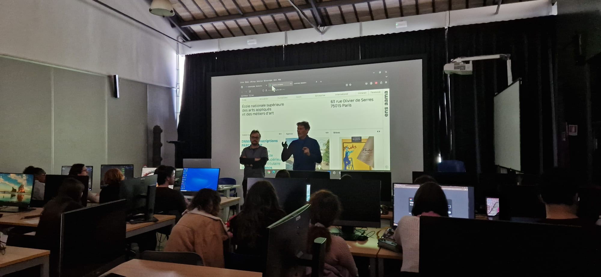
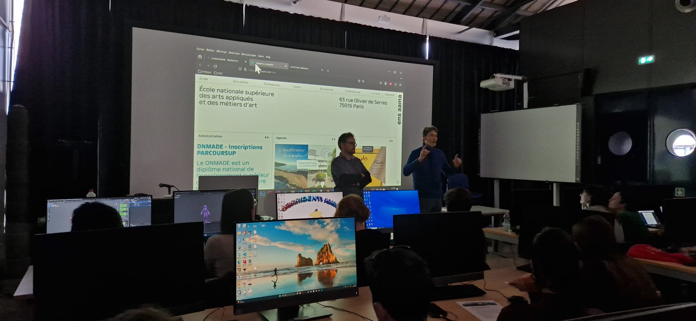
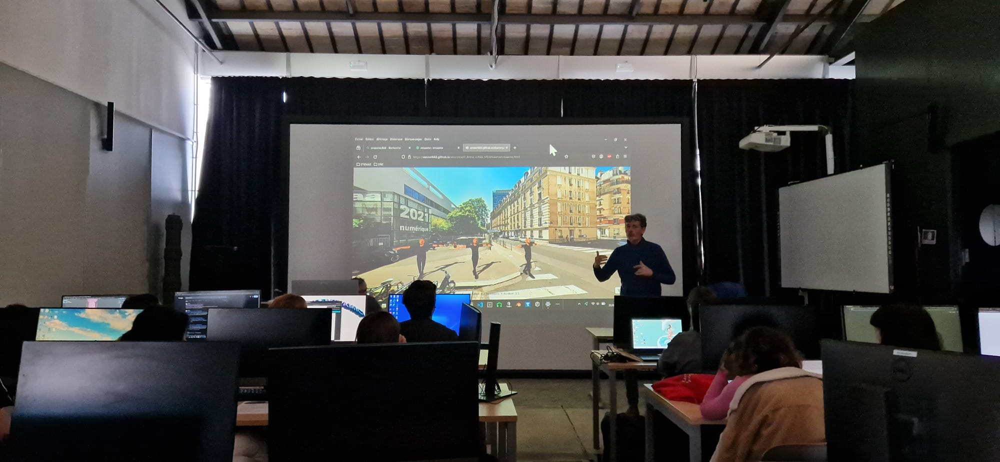
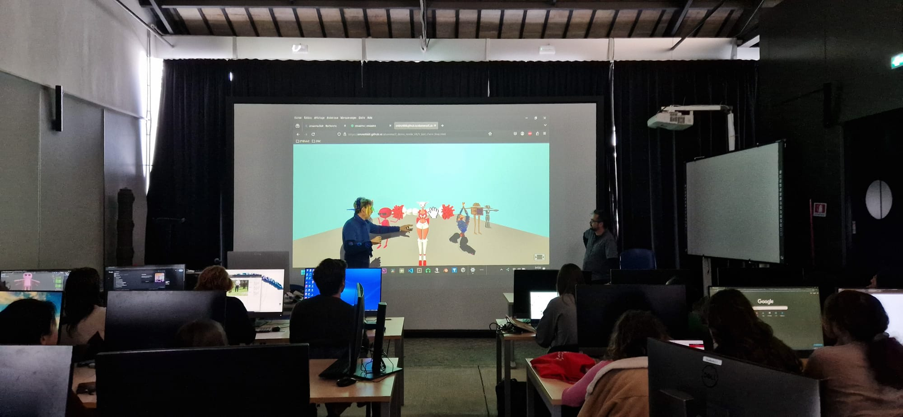
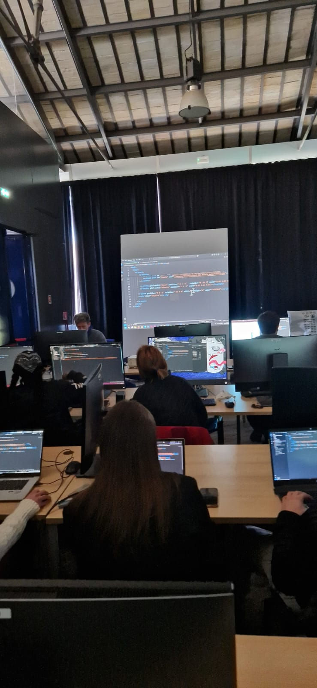
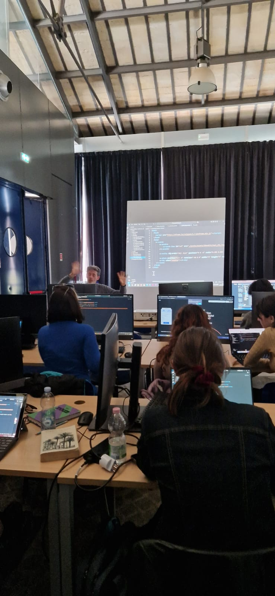
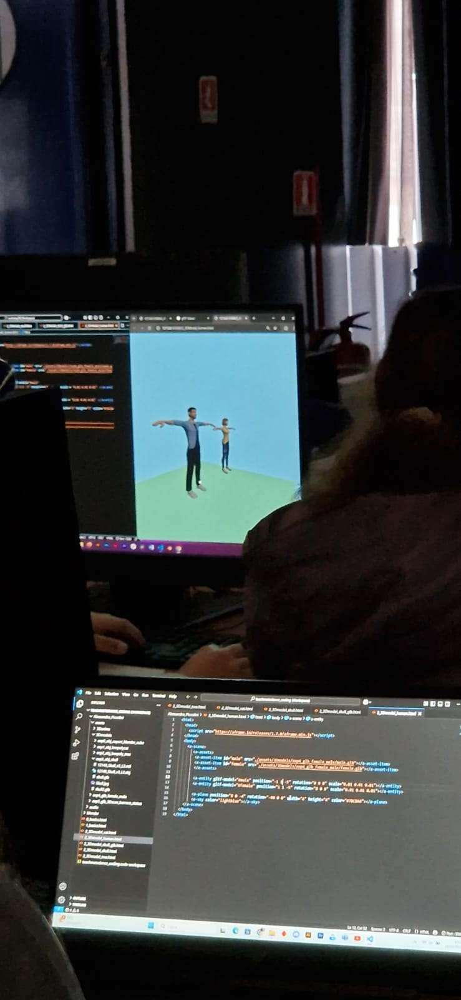
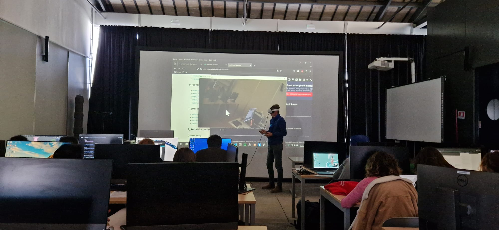
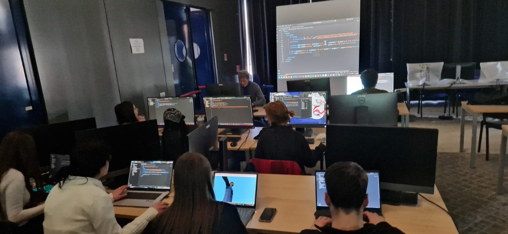

### presentations : ensaama / numeric department / workshop
*about ensaama, Paris*

*about numeric department*

* [positioning the numeric department (pdf)](../../1_presentation/workshop_abaroma_ensaama_num.pdf)

*about the workshop : 3D animation & VR/AR*

* [workshop flyer (pdf)](../../1_presentation/flyer/abaroma_flyer.pdf)
* [whorkshop program (pdf)](../../1_presentation/workshop_abaroma_program.pdf)

### 3D animation teaching

### VR/AR teaching

    
    
    

    
    
    

